# The George Orwell Pub

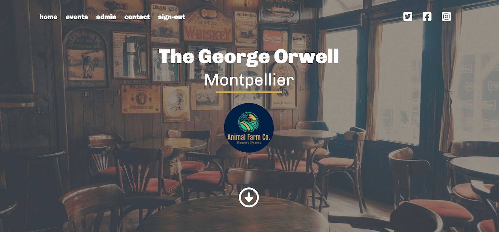
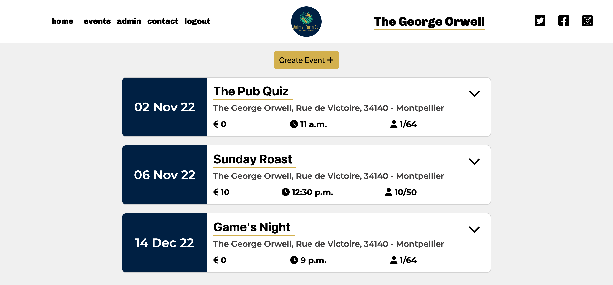

The George Orwell Pub website is a django based project for a fictional business developed for my fourth milestone project at Code Institute.

## Brief

The George Orwell Pub website serves as a point of information and booking system for a pub and restaurant based in Montpellier, France. Customers will be able to create an account, view upcoming events, and make bookings. Within their account they will be able to manage these bookings, as well as contact the site Admin with any queries that they might have. 

The objective of the project is to create an aesthetically pleasing design with functionality that allows users to access and interact with content easily, and that allows an Admin to intuitively control the data that the site works with.. 

## UX

Users of the George Orwell Pub website would most likely be young adults in and around the area - many of which might be regulars that would be revisiting the site to book an event on a weekly basis. This means that navigating through the booking system should be as fast and easy as possible, so that users who only need to make a booking can do so without hassle.

###  User Stories

**Epic: Site Management**
- As an **admin** I can **login to an admin panel** so that I can manage my website
- As an **admin** I can **create events** so that I can notify site visitors of the business schedule
- As an **admin** I can **update existing events** so that **I can keep the schedule up to date**
- As an **admin** I can **delete events** so that **I can cancel events that are no longer going to happen**.
- As an **admin** I can **delete bookings** so that I can cancel existing bookings if necessary
- As an **admin** I can **delete users** so that **I can remove existing users if necessary**
- As an **admin** I can **view and respond to user queries** so that **I can interact with my clientele**

**Epic: Event Booking**
- As a **user** I can **register an account** so that I can book my place at events and send site queries.
- As a **user** I can **sign in and out of my account** so that **access to my account and data is limited**
- As a **user** I can **book events** so that I can reserve a place at events of my choosing
- As a **user** I can **update my existing bookings** so that I can add or remove people on my reservation
- As a **user** I can **delete an existing booking** so that I can remove my reservation if I no longer wish to come

**Epic: Account Management**
- As a **user** I can **request an account deletion** so that I can remove my account from the site**
- As a **user** I can **send a query to the admin** so that **I can contact them with any questions of request I have**

## Agile Development

Using the User Stories above the site was developed using AGILE methodology. Components and features in the website were designed in order to meet the criteria of the user stories and each stage of development revolved around resolving each user story incrementally. 

This meant that each component added to the site could be prioritized by the importance of its corresponding user story.

## Design

### Design Objective
- The site is attractive and first time users want to return to it.
- Site actions are intuitive so that a user knows how to interact with content.
- The site is functional and errors and the user will be appropriately redirected when faced with errors
- Content is meaningfully organized by its priority

### Wireframes
The wireframes for the George Orwell Pub were made with Figma. Designs for multiple viewport sizes were created in order to create a design that would be responsive on various devices.

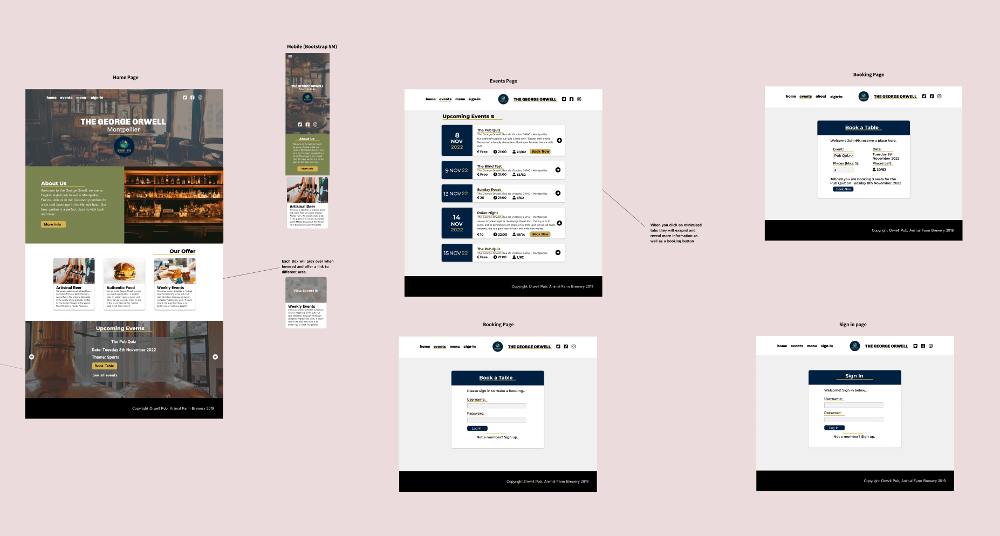

The final design holds true to the original concepts, but as development progressed certain aspects differed. This was usually due to design preference changing as time went on, and certain components looking better in the browser than they did in the wireframe.

### Color Scheme/Typography

The Color Scheme of the website was generated using [**Coolors**](https://coolors.co/). Outside of the home page most of the colors are black and white - this simple scheme was chosen to represent pen and paper as the business is named after the writer George Orwell. 

The fonts on the site are Montserrat, Chivo, Istok Web, and Heebo.

## Features

### Existing

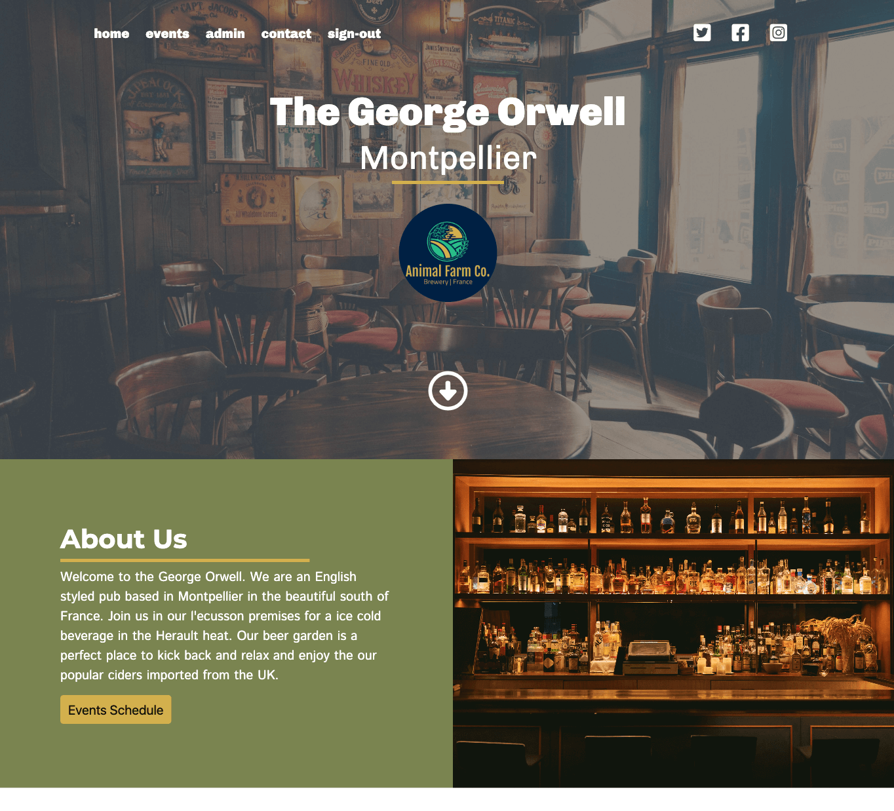
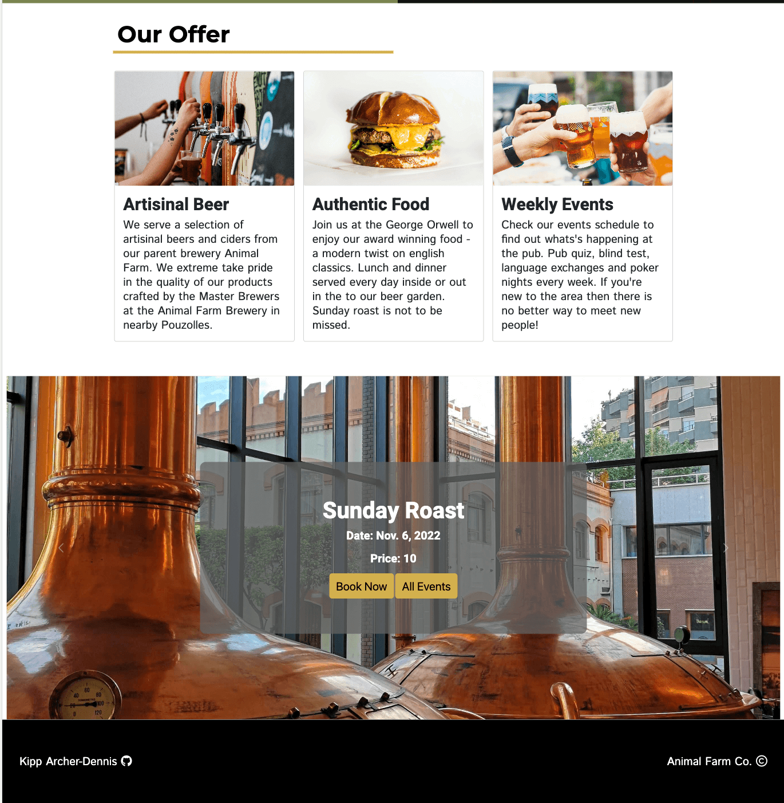

**Homepage:** The homepage is the first area that the user sees when entering the website. It includes a summary of the business and what it does, as well as clear navigation to other areas of the site and a carousel of upcoming events.

---

**Events Page:** The events page displays all upcoming events with the relevant information about them (Date, capacity, price). Each event is a collapsible element, revealing the event description when clicked on - this keeps the content more concise and allows the user to unravel information as they choose to. The user can also book an event by clicking on the Book now button and filling out the form. If an admin is logged in they are able to access full CRUD functionality for each event, as well as creating new events.

---

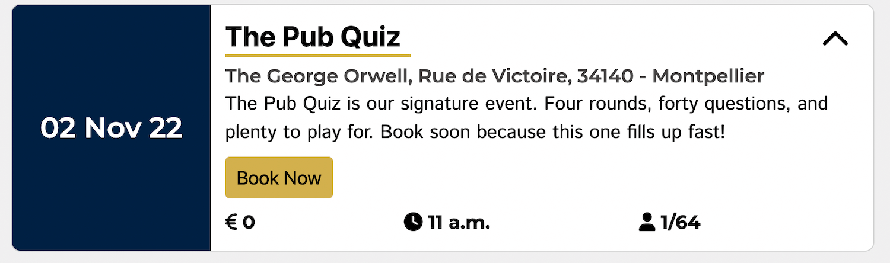
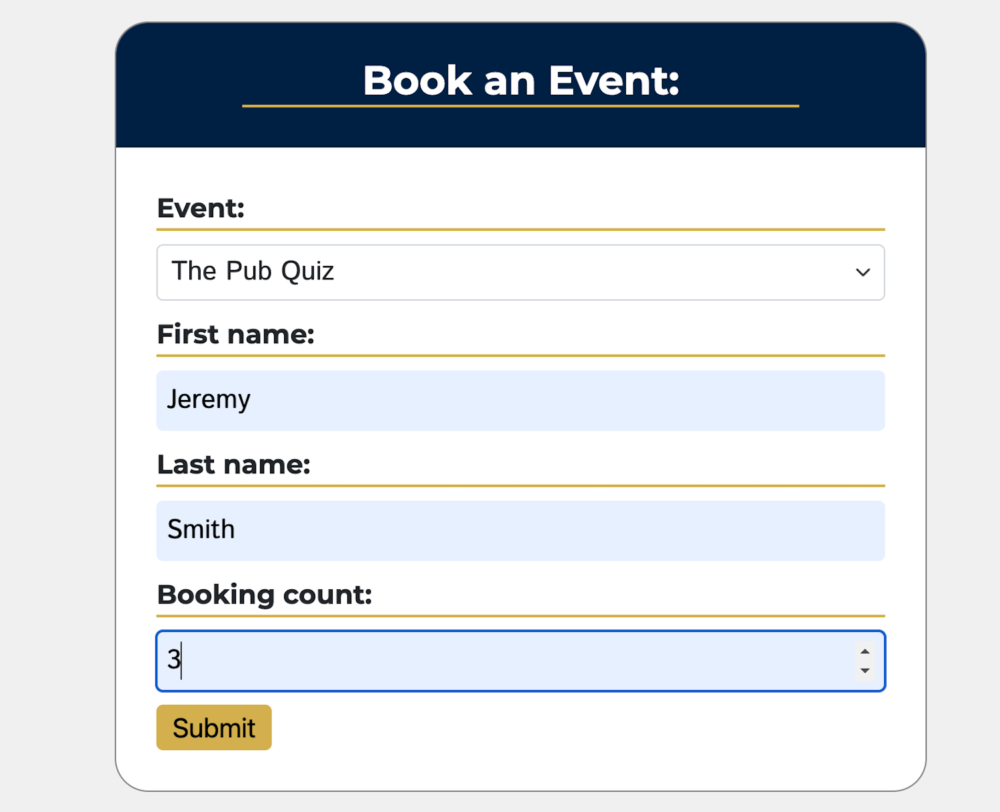
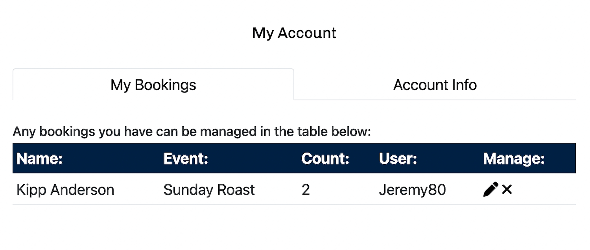

**Booking System:** The booking system allows users to reserve places for events of their choosing. There is full form validation preventing users from making double bookings and also from events becoming overbooked. 

---

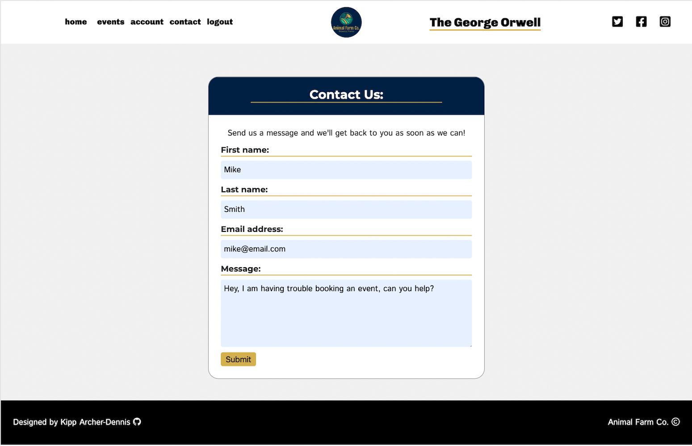
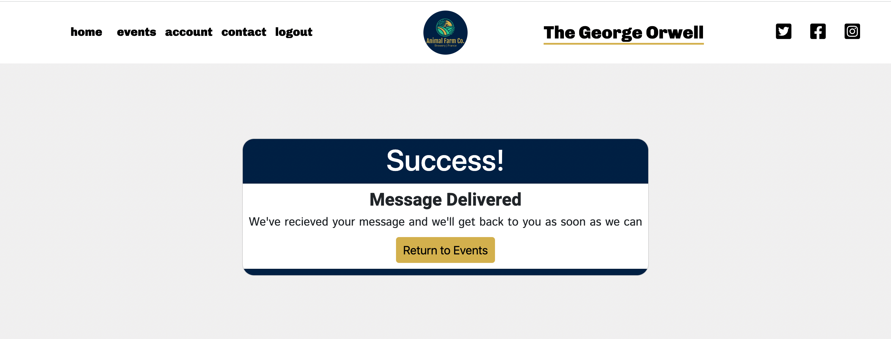
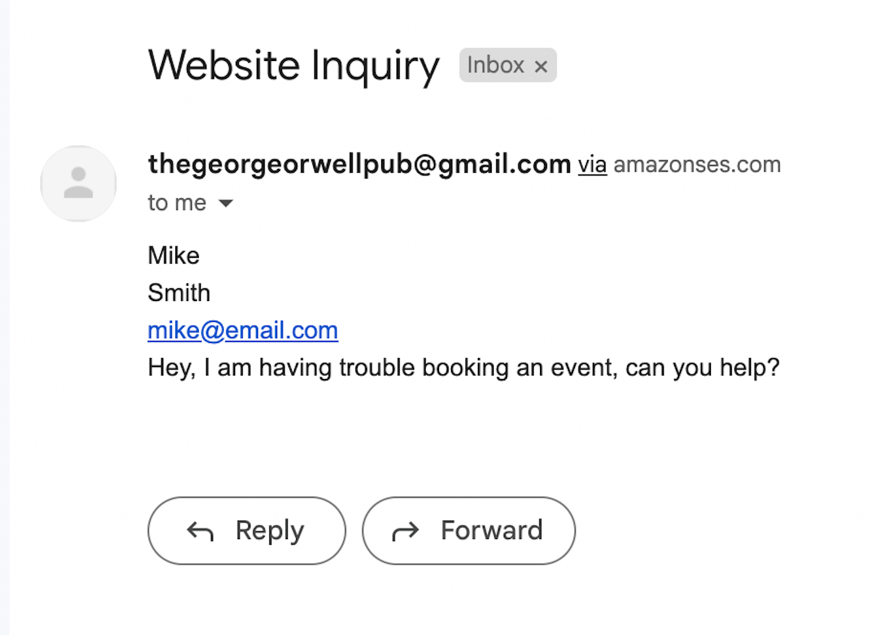

**Contact Form:** The contact form allows users to send queries to the admin. This form is linked to Amazon Web Services SES, meaning that the user’s messgae will appear in the gmail account of the site.

---

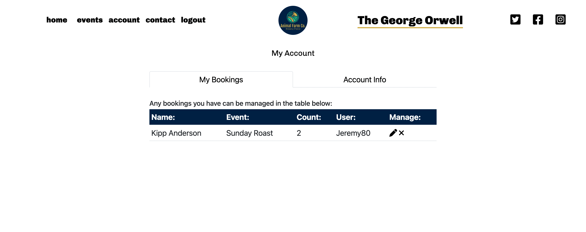
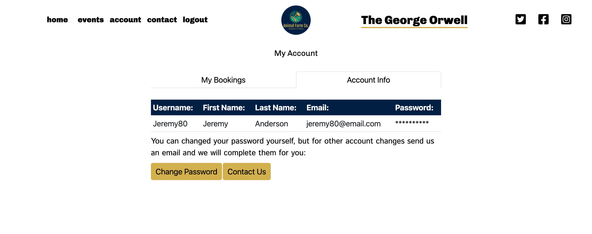

**Account Page:** The account page allows users to view, update, and delete their existing bookings. It will also display their account information in a separate tab.

---

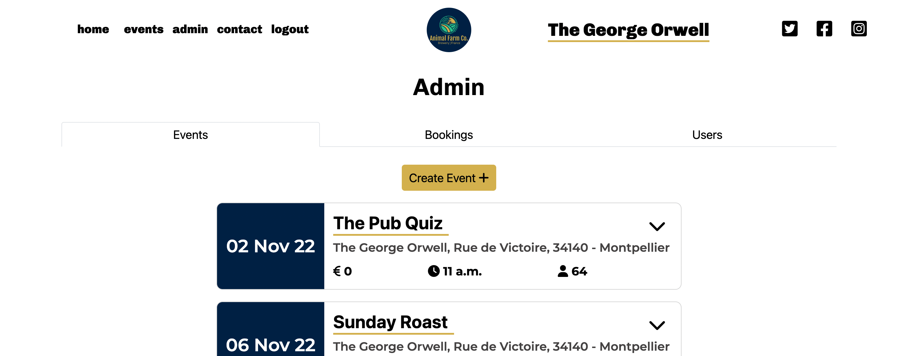
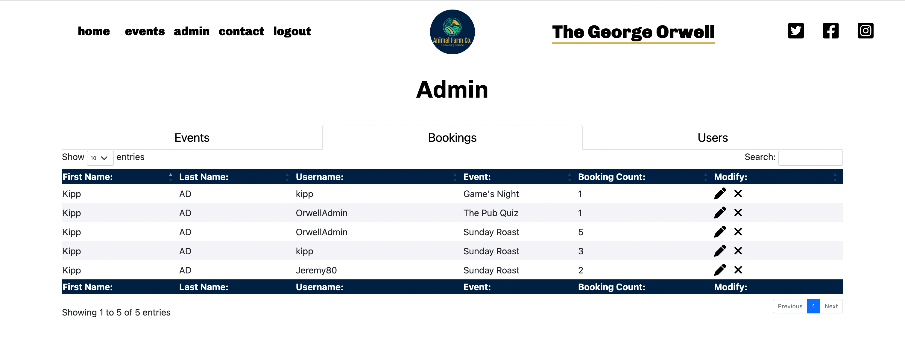
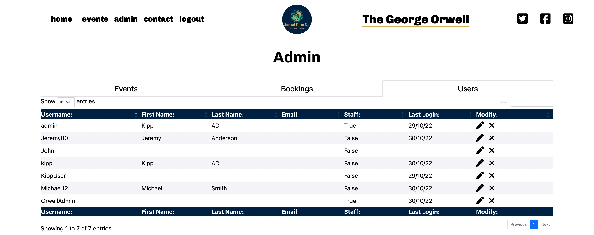

**Admin Interface:** The admin interface displays all events, bookings, and users where the admin can perform CRUD functionality on each of their models.

-- 

**User Feedback Pages:** Unsuccessful bookings will redirect the user to a page explaining why their submission was rejected. Similarly a successful booking and contact form submission will display a success page.

--

**Accounts:** Users can register an account and login/logout. Once authenticated they are able to interact with the sites content.

---

## Future
Here are some future features that were outside of the project scope on the current iteration of development but could be included to improve the user experience and site in general.

- **Form Submission Email:** User receives an email when an account is created or when a booking is made.
- **Waiting List:** Users will have the option to join a waiting list for full events and receive an email if there is availability.
- **Prefilled Booking Form:** Booking form is prefilled with the event and can be replaced with a select form if the user chooses.
- **Repeating/Self Deleting Event:** Events can be set to repeating so that they automatically appear on the schedule each week, and events in the past self-delete.

- **Messaging In Browser:** User and admin can message within the website from the account and admin panels respectively.
- **Menu:** Admin has access to CRUD functionality for a menu.
- **Admin Interface for User:** Whilst the admin can see users in the admin panel, it redirects the admin to the default django admin dashboard, so CRUD functionality for the user within the website would provide a better experience for the site owner.

## Reflection 

This project was particularly challenging for myself coming off the back of a leave of absence and integrating technologies that I had never used before. Getting to grips with Bootstrap and Django meant that at times it was hard to develop the project that matched the agile project board. Similarly, I had to be a lot more flexible with the intended components and features because when I developed the scope of the project I did not have any reference point of working with these technologies before - this did mean sacrificing on what I actually wanted to develop in order to meet the deadline. It was a steep learning curve, but in future projects I will have a much greater understanding of how to plan and implement the required aspects to a standard that I am more content with.
